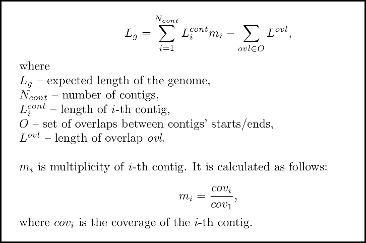

# combinator-FQ
Tool for detecting adjacent contigs and calculating LQ-coefficient

### Description

Script identifies adjacent contigs in order to facilitate further scaffolding.

Format of input: multi-fasta file containing contigs.

Script supports contigs assembled by SPAdes and A5.

It calculates LQ-coefficient, defined as follows:


Length of overlap is further referred to as *k*. *k-start* (*k-end*) denotes contig's prefix (suffix) of length *k*.

Ends of contigs are considered adjacent in following situations:


combinator-FQ calculates expected length of the genome as follows:



### Dependencies

The script is written in Python, so you need Python interpreter (version 3.X) to use it. [Here you can download Python](https://www.python.org/downloads/).

### Explanation of output files

Script generates 3 output files:

#### 1) Table containing information about contigs adjacency:

    <prefix>_combinator_adjacent_contigs.tsv

Format of table is following:

```
#  Contig name  Length  Coverage  GC(%)  Multiplicity  Annotation  Start         End
1  NODE_1...    304356  93.7155   34.12  1.2           [empty]     [S=E(NODE_22); ovl=127]  [E=rc_E(NODE_26); ovl=99]
...
```
Explanation of "Start" and "End" columns:

- `[S=E(NODE_22); ovl=127]` means that k-start (`S`) of contig `NODE_1...` is identical to k-end (`E`) of contig `NODE_22`, and overlap length is 127 (`ovl=127`).

- `[E=rc_E(NODE_26); ovl=99]` means that k-end of contig `NODE_1...` is identical to reverse complement (`rc_`) k-end of contig `NODE_26`, and overlap length is 99 (`ovl=99`).

#### 2) File, in which all matchings (not only adjacency-associated) are listed:

    <prefix>_combinator_full_matching_log.txt

#### 3) Brief summary:

    <prefix>_combinator_summary.txt

### Options

```
-h (--help): print help message;

-v (--version): print version;

-i (--mink): minimum k (in b.p.) to consider.
  Value: integer > 0; Default if 21 b.p.

-a (--maxk): maximum k (in b.p.) to consider.
  Value: integer > 0; Default is 127 b.p.

-k (--k-mer-len): exact k (in b.p.).
  If specified, '-i' and '-a' options are ignored.
  Value: integer > 0; Option is disabled by default;

-o (--outdir): output directory;
  Default value: 'combinator-result'
```

### Examples

```
  ./combinator-FQ.py contigs.fasta -k 127 -o my_outdir
```

```
  ./combinator-FQ.py another_contigs.fa -i 25 -a 300 -o my_outdir
```

If input file is omitted in the command (like in the command below), combinator-FQ will process all fasta files in the working directory.

```
  ./combinator-FQ.py -i 25 -a 300 -o my_outdir
```
